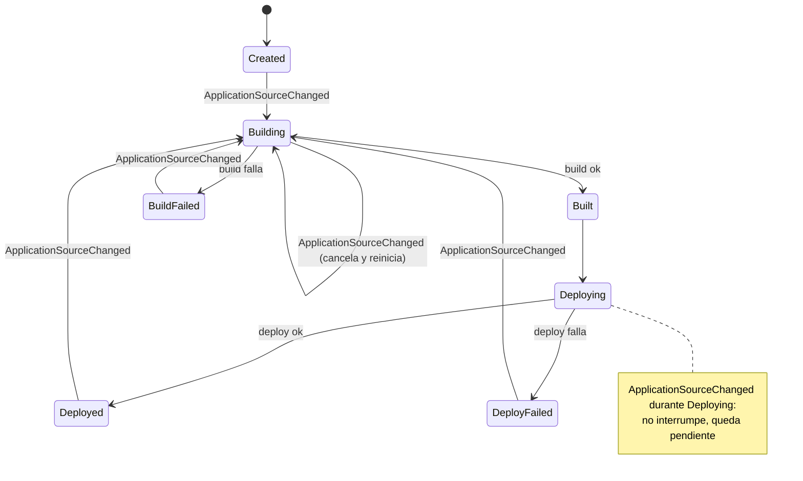

# Discovery — App Manager

**Status**: Ready for Modeling
**Last session**: 2026-09-12
**Bounded Context**: App Manager (aplicación frontal para los usuarios; agregados propios: Application, Build [reflejo], Deployment [reflejo])
**Contexto heredado**: ver `context-map.md` — App Manager es agnóstico de las reglas de Build y Deploy, solo refleja su estado. **Corrección (ver `project/discovery.md`)**: `Application` representa un servicio *dentro* de un `Project` (monorepo) — su identificador de negocio ya no es `appHash` sino `serviceName`, único dentro de su Project, no globalmente. El `hash` público vive en `Project`

---

## Ubiquitous Language

| Term | Definition | Status |
|---|---|---|
| Application | Un servicio desplegable dentro de un `Project` — la unidad que corre como imagen de contenedor | ✅ Confirmed |
| Team | Dueño real de un `Project`, no de cada `Application` suelta. Aggregate de otro BC aún sin nombre. `Application` guarda una copia materializada de `teamId` para filtrar sin pasar por Project | ✅ Confirmed que existe y es aggregate; fuera de App Manager |
| serviceName | **Renombrado desde `appHash`.** Identificador de negocio de la Application — único *dentro* de su Project (`app`, `frontend`...), no globalmente. Compone la URL pública junto al `hash` del Project: `{serviceName}.{project.hash}.apperture.dev` | ✅ Confirmed |
| projectId | Referencia plana al `Project` (otro BC) al que pertenece esta Application | ✅ Confirmed |
| Build (reflejo) | Estado de la última fase de construcción, reflejado desde el BC Build — no sus reglas | ✅ Confirmed |
| Deployment (reflejo) | Estado de la última fase de despliegue, reflejado desde el BC Deploy — no sus reglas | ✅ Confirmed |

## Aggregate Candidates

| Name | Responsibilities | Invariants | Status |
|---|---|---|---|
| Application | Representa un servicio dentro de un Project; identidad técnica (`id`, UUID) y estado general. `serviceName` es atributo de negocio (parte de la URL pública), no la identidad interna. Guarda `projectId` (referencia a `Project`, otro BC — dueño real de `teamId`), `teamId` (**copia materializada de solo lectura**, fijada al registrar — para filtrar por equipo sin pasar por Project) y `templateId` (referencia al catálogo `Template` de Build) | Ver máquina de estados abajo | 🆕 Proposed |
| ApplicationHistoryLog | Registro de cada transición de `Application` — `id` propio (UUID), snapshot `ApplicationDTO` antes/después | Append-only, nunca se modifica ni se borra una entrada existente. **Solo `Application` puede crear una instancia** — aggregate propio, pero sin fábrica externa | ✅ Confirmed — aggregate propio, construcción restringida a `Application` |

## State Machine — Application

**Estados**: `Created`, `Building`, `Built`, `Deploying`, `Deployed`, `BuildFailed`, `DeployFailed`

| From | Trigger | To |
|---|---|---|
| *(inicio)* | Application registrada | `Created` |
| `Created` | `ApplicationSourceChanged` | `Building` |
| `Building` | Build exitoso | `Built` |
| `Building` | Build falla | `BuildFailed` |
| `Built` | *(automático)* | `Deploying` |
| `Deploying` | Deploy exitoso | `Deployed` |
| `Deploying` | Deploy falla | `DeployFailed` |
| `Deployed` | `ApplicationSourceChanged` | `Building` |
| `BuildFailed` | `ApplicationSourceChanged` | `Building` |
| `DeployFailed` | `ApplicationSourceChanged` | `Building` |
| `Building` | `ApplicationSourceChanged` *(build ya en curso)* | `Building` *(se cancela el build actual, se reinicia con la revisión nueva — mismo comportamiento que GitLab CI/CD al cancelar la pipeline anterior ante un push nuevo)* |
| `Deploying` | `ApplicationSourceChanged` *(deploy ya en curso)* | *(sin transición — se registra como revisión pendiente; el deploy en curso NO se interrumpe, igual que ArgoCD no arranca el siguiente release hasta que el actual está en verde o fallado)* |
| `Deployed` / `DeployFailed` | *(si hay una revisión pendiente registrada durante `Deploying`)* | `Building` *(automático, sin esperar al siguiente sondeo de AppSource)* |

**Invariantes:**
- Máquina de estados estricta: solo son válidas las transiciones de la tabla — ninguna otra combinación existe (no se puede, p. ej., mostrar `Deployed` sin haber pasado por `Built`).
- `ApplicationSourceChanged` es un evento disparador, **nunca** un estado propio de `Application`.
- Nunca se reinicia un ciclo (vuelta a `Building`) sin un `ApplicationSourceChanged` previo — ni siquiera tras un fallo.
- Concurrencia distinta por fase: `Building` se interrumpe y reinicia ante un cambio nuevo (barato de repetir); `Deploying` nunca se interrumpe — un cambio durante el despliegue queda pendiente y se procesa en cuanto el despliegue en curso llega a un estado terminal.

## Domain Actions (derivadas de la máquina de estados — a confirmar)

| Action | Comportamiento (depende del estado actual de Application) | Produce |
|---|---|---|
| `registerApplication` *(consume evento `ServiceDiscovered`, publicado por Project)* | *(inicio)* → `Created` | `ApplicationHistoryLog` + publica `ApplicationRegistered` |
| `markSourceChanged` *(consume evento `ApplicationSourceChanged`, publicado por Project — ya no `SourceChanged` de AppSource directamente)* | Una sola acción, tres comportamientos según el estado actual: desde `Created`/`Deployed`/`BuildFailed`/`DeployFailed` → transiciona a `Building`; desde `Building` → cancela y reinicia (sigue en `Building`); desde `Deploying` → no transiciona, anota la revisión nueva | `ApplicationHistoryLog` en los dos primeros casos (+ publica `ApplicationBuildRequested`) — ¿y en el tercero? ver ambigüedad |
| `markBuildSucceeded` *(consume evento `BuildSucceeded`)* | `Building` → `Built` → `Deploying` | `ApplicationHistoryLog` + publica `ApplicationDeployRequested` |
| `markBuildFailed` *(consume evento `BuildFailed`)* | `Building` → `BuildFailed` | `ApplicationHistoryLog` |
| `markDeploySucceeded` *(consume evento `DeploySucceeded`)* | `Deploying` → `Deployed` | `ApplicationHistoryLog` |
| `markDeployFailed` *(consume evento `DeployFailed`)* | `Deploying` → `DeployFailed` | `ApplicationHistoryLog` |

**`Deploying` + `ApplicationSourceChanged` — MVP confirmado:** se marca un flag interno `hasPendingSourceChange` en `Application` (sin transición de estado, sin guardar la revisión concreta — al resolverse el deploy se pregunta a AppSource cuál es la última). Al llegar `markDeployFailed` o `markDeploySucceeded`, si el flag está activo, se dispara `markSourceChanged` automáticamente.

~~`redeploy`~~ — descartado. Con ArgoCD auto-sanando el estado deseado, no hay caso de uso hoy; solo aplicaría si un deploy se borrara externamente, fuera de alcance actual.

## Captured Invariants (deseable, no MVP)

| Rule | Status |
|---|---|
| Optimización de solapamiento: si `ApplicationSourceChanged` llega durante `Deploying`, el build de la revisión nueva arranca **en paralelo** con el deploy en curso (solo el paso de publicar sigue esperando su turno) — evita el tiempo muerto del MVP, a costa de trackear dos progresos semi-independientes en vez de uno | 🕓 Deseable, diferido — MVP usa el flag simple, sin paralelismo |

## Aggregate-level Mechanics

| Concern | Detail | Status |
|---|---|---|
| `version` — doble propósito | `Application` lleva un campo `version`: (1) optimistic lock — toda escritura verifica la versión leída para evitar que dos actualizaciones concurrentes se pisen; (2) **tag de despliegue** — el mismo valor etiqueta la imagen construida y el release de ArgoCD. Timestamp incremental ordenado, **no semver**. Lo mintea `Application` (App Manager), nunca el SHA de git — mantiene la atomicidad del ciclo build→deploy bajo control centralizado, y evita que `Build`/`AppSource` tengan que saber nada sobre cómo se etiquetan los despliegues | ✅ Confirmed |

## Value Object Candidates

| Name | Construction Rule | Scope | Status |
|---|---|---|---|
| serviceName | *(regla de generación sin discutir — antes `appHash`)* | Application (atributo de negocio, único dentro de su Project) | 🆕 Proposed |
| id | UUID — identidad técnica interna, distinta de `serviceName` | Todo aggregate (convención general) | ✅ Confirmed — convención de modelado |
| ApplicationDTO | Snapshot canónico del estado de una Application en un instante — mismo shape usado en vivo y dentro de cada `ApplicationHistoryLog` | Application | 🆕 Proposed |
| version | Timestamp incremental ordenado, no semver. Minteado por `Application` — sirve como optimistic lock y como tag de despliegue | Application | ✅ Confirmed forma; momento exacto de generación sin discutir |

## Domain Events

| Name | Trigger | Payload | Status |
|---|---|---|---|
| `ApplicationRegistered` | `Application` entra en `Created` | `id`, `serviceName`, `projectId`, `teamId` (copiado de `Project` al registrar) | ✅ Confirmed — consumidores por descubrir |
| `ApplicationBuildRequested` *(nombre propuesto)* | `Application` entra en `Building` (desde cualquier acción de `markSourceChanged`) | `serviceName`, `projectId`, `templateId`, `version`, `revision`, `repositoryUrl`, `provider` (los tres últimos propagados desde `ApplicationSourceChanged`, que a su vez los recibió de `SourceChanged` de AppSource vía Project — nunca una consulta directa de Build a AppSource) | 🆕 Proposed — consumido por Build |
| `ApplicationDeployRequested` *(nombre propuesto)* | `Application` transiciona `Built` → `Deploying` | `serviceName`, `projectId` (para saber en qué namespace desplegar), `version`, referencia a la imagen construida | 🆕 Proposed — consumido por Deploy |

## Open Ambiguities

| Question | Context | Resolution |
|---|---|---|
| ~~"De quien son" las apps importa para el registro...~~ | Application | ✅ Resuelto — el dueño es un `Team`, aggregate de otro BC (sin nombre todavía). Identidad de usuario no se modela (Keycloak + JWT) |
| ~~¿`Application` necesita guardar un `teamId` propio...?~~ | Application / Team | ✅ Resuelto — sí, pero como copia materializada de solo lectura (dueño real: `Project`). Ver resolución final más abajo |
| ~~¿Un `Token` da acceso a una sola Application, o a todas las de un Team?~~ | Token | ❌ Cancelado — `Token` sale del modelo por completo. Solo se soportan repos públicos; ningún equipo necesita subir credencial alguna. Ver nuevo BC `AppSource` |
| ~~La tabla de transición no cubre `Building → Building` ni `Deploying → Deploying`...~~ | Application | ✅ Resuelto — `Building`: se cancela y reinicia (precedente: GitLab CI/CD). `Deploying`: no se interrumpe, el cambio queda pendiente hasta estado terminal (precedente: ArgoCD) |
| Nota para cuando se implemente: la "revisión pendiente" que `Application` recuerda durante `Deploying` — ¿es el mismo dato que el `attempted-sha`/`deployed-sha` que ya vive en AppSource, o `Application` necesita su propio campo? Evitar llevar el mismo hecho por duplicado en dos BCs | Application / AppSource | Pendiente — no bloqueante |
| ~~¿`ApplicationHistoryLog` es su propio aggregate...?~~ | Application / ApplicationHistoryLog | ✅ Resuelto — aggregate propio, pero solo `Application` puede crear una instancia (sin fábrica externa) |
| ~~Cuando `markSourceChanged` llega durante `Deploying`...?~~ | Application / ApplicationHistoryLog | ✅ Resuelto — sí genera log. Regla general: **cualquier** acción de dominio que mute `Application` produce un `ApplicationHistoryLog`, sin distinguir transición de estado de cambio de flag interno. Confirma que `hasPendingSourceChange` vive dentro de `ApplicationDTO` |
| ~~¿En qué momento mintea Application un version nuevo...?~~ | Application / version | ✅ Resuelto — siempre en cada `markSourceChanged`, sin excepción. Un ciclo que termina en `BuildFailed`/`DeployFailed` no deja nada huérfano: esa versión queda como "nunca desplegada," resultado terminal válido, no un error a limpiar |
| ~~¿`Application.teamId` se mueve a `Project`...?~~ | Application / Project / Team | ✅ Resuelto — `Team` es dueño de `Project`. `Application.teamId` se mantiene como **copia materializada de solo lectura**, fijada al registrar (para filtrar "apps de un equipo" sin pasar por Project) — un solo dueño de la verdad, sin segundo camino de escritura. App Manager queda sin ambigüedades abiertas |

## Session Log

### 2026-09-12
- Arranca el discovery de agregados para App Manager, tras cerrar el mapa de contextos.
- El arquitecto identifica el registro de la Application (identidad, propiedad) como punto de entrada, antes que Build/Deploy — que son "consecuencia de cómo queremos llevar las aplicaciones en Kubernetes".
- Investigado patrón de Vercel/Netlify para modelar propiedad: Project/Site pertenece siempre a un Team (nunca a un User directo); confirma por qué `userId` no necesitaba modelarse antes. Pendiente: alcance de `Team` para Podium (rico vs. mínimo).
- Resuelto de forma distinta a lo investigado: `Team` es autogenerado (mínimo, sin registro manual), y `userId` aparece como atributo de un aggregate nuevo y separado, `Token` (acceso), no de `Team`. Pendiente: si `Team` es aggregate o value object.
- Corrección: `Team` SÍ es aggregate, pero de otro BC (sin nombre aún) — no de App Manager. Decisión capturada: identidad/usuario no se modela como dominio propio — Keycloak + JWT lo resuelve; `userId` es el claim `sub`, referencia externa opaca.
- Resuelto: `Application.teamId` existe como referencia plana (solo el id), necesaria para autorización de `Token` — sin acoplamiento rico al `Team`.
- `Token` cancelado por completo: no se soportan repos privados en el hackathon, ningún equipo sube credencial alguna. Nace BC `AppSource` para la relación con el proveedor de código — ver `appsource/discovery.md`. Pendiente para retomar: invariantes de `Application`.
- Máquina de estados de `Application` capturada completa (7 estados, transición estricta, `SourceChanged` como evento no como estado). Gap detectado: comportamiento no definido si `SourceChanged` llega mientras ya está en `Building` o `Deploying`.
- Resuelto con precedente real: `Building` cancela y reinicia (GitLab CI/CD); `Deploying` no se interrumpe, queda pendiente hasta estado terminal (ArgoCD). Nota abierta no bloqueante: evitar duplicar el tracking de revisión entre Application y AppSource.
- Historial resuelto: `ApplicationHistoryLog` genérico (snapshot `ApplicationDTO` antes/después) en vez de una entidad distinta por tipo de intento. `ApplicationHistoryLog` confirmado como aggregate propio, construible solo desde `Application`.
- Corrección: las tres acciones derivadas del caso `SourceChanged` se colapsan en una sola (`markSourceChanged`), con comportamiento distinto según el estado actual — no tres comandos separados. `redeploy` descartado (ArgoCD auto-sana; sin caso de uso hoy).
- Mecánica de concurrencia precisada: MVP usa flag simple `hasPendingSourceChange` (sin paralelismo); solapamiento build/deploy capturado como optimización deseable y diferida. Optimistic locking (`version`) confirmado como mecanismo genérico del aggregate, independiente de cuál versión se implemente.
- `version` pasa a tener doble propósito: optimistic lock + tag de despliegue. Timestamp incremental, no semver, minteado por `Application` — nunca el SHA de git, que sigue siendo lenguaje propio de AppSource/Build.
- Regla general capturada: toda acción de dominio que mute `Application` produce `ApplicationHistoryLog`, sin excepción — incluye `hasPendingSourceChange` (confirma que vive en `ApplicationDTO`). `version` se mintea siempre en cada `markSourceChanged`; un ciclo fallido no deja nada huérfano.
- **Revisión importante**: App Manager no es un reflejo pasivo — es el orquestador central. Publica `ApplicationBuildRequested` (para que Build arranque) y `ApplicationDeployRequested` (para que Deploy arranque). Ni AppSource ni Build se hablan directamente con la fase siguiente — todo pasa por Application. App Manager queda sin ambigüedades abiertas.
- Convención general capturada: todo aggregate lleva su propio `id` (UUID). `Application` lo tenía pendiente — `appHash` se redefine como atributo de negocio (slug de la URL pública), no la identidad interna. Aplicado también a `ApplicationHistoryLog`.
- Nombrados los eventos que faltaban: `BuildSucceeded`, `DeployFailed`, `DeploySucceeded` (consumidos por App Manager) y `ApplicationRegistered` (publicado por App Manager al registrar, consumidores por descubrir). App Manager publica ahora tres eventos: `ApplicationRegistered`, `ApplicationBuildRequested`, `ApplicationDeployRequested`.
- Cross-context (desde el discovery de Build): `Application` añade `templateId`, referencia plana al catálogo `Template` de Build — mismo patrón que `teamId`. Pendiente: dónde viven los parámetros de ejecución por app (nombre de solución .NET, script npm), que no caben en el catálogo compartido.
- Corrección de consistencia: el payload de `ApplicationBuildRequested` propaga `revision`, `repositoryUrl` y `provider` desde `SourceChanged` — Build nunca consulta directamente a AppSource, todo viaja en el evento.
- **Revisión importante (nace `Project`)**: un `podium.yaml` real reveló monorepos con varios servicios desplegables. `appHash` se renombra a `serviceName` (único dentro de su Project, no global); se añade `projectId`. `Application` ya no consume `SourceChanged` de AppSource directamente — consume `ApplicationSourceChanged`, publicado por `Project` (que reparte por servicio). Reabierta la pregunta de si `teamId` se queda en `Application` o se mueve a `Project`.
- Resuelto: `Team` es dueño de `Project`, no de cada `Application`. `Application.teamId` se mantiene como copia materializada de solo lectura (fijada al registrar, copiada de `Project`) — filtra por equipo sin pasar por Project, sin crear un segundo dueño de la verdad. App Manager queda sin ambigüedades abiertas.
