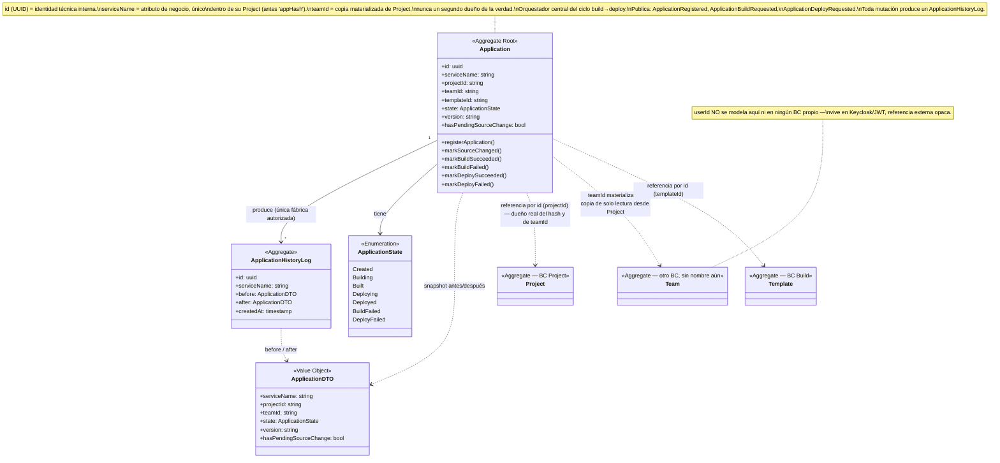
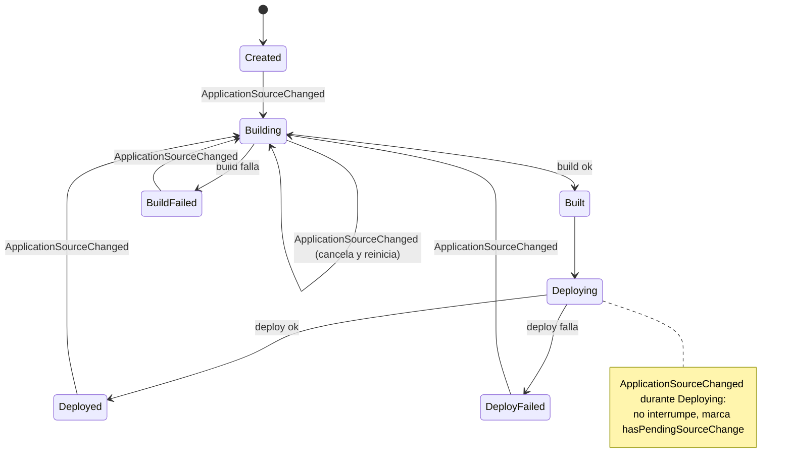

# Model — App Manager

**Derivado de**: `discovery.md` (sesión cerrada, sin ambigüedades bloqueantes)
**Fecha**: 2026-09-12

---

## Diagrama de clases

## Máquina de estados

## Resumen de responsabilidades

| Elemento | Tipo | Responsabilidad |
|---|---|---|
| `Application` | Aggregate Root | Identidad técnica (`id`, UUID) y estado general de un servicio dentro de un Project. `serviceName` es su atributo de negocio (único dentro del Project). Único orquestador del ciclo build→deploy: decide cuándo cada fase debe actuar y lo comunica por evento |
| `ApplicationHistoryLog` | Aggregate (fábrica restringida) | Auditoría append-only de toda mutación de `Application` — snapshot `ApplicationDTO` antes/después |
| `ApplicationDTO` | Value Object | Forma canónica del estado de una `Application` en un instante, reutilizada en vivo y en cada log |
| `version` | Value Object (campo de `Application`) | Timestamp incremental — optimistic lock + tag de despliegue. No semver |
| `Project` | Referencia externa | Dueño real del `hash` público y de `teamId`; `Application` lo referencia por id |
| `Team` | Referencia externa (vía Project) | `teamId` en `Application` es copia materializada de solo lectura, no un segundo dueño |
| `Template` | Referencia externa | Catálogo de Build; `Application` lo referencia por `templateId` |

## Eventos publicados

| Evento | Disparado por | Consumido por |
|---|---|---|
| `ApplicationRegistered` | `Application` entra en `Created` | *(por descubrir)* |
| `ApplicationBuildRequested` | `Application` entra en `Building` | Build |
| `ApplicationDeployRequested` | `Application` transiciona `Built` → `Deploying` | Deploy |

## Eventos consumidos

| Evento | Origen | Acción resultante |
|---|---|---|
| `ServiceDiscovered` | Project | `registerApplication` |
| `ApplicationSourceChanged` | Project | `markSourceChanged` |
| `BuildSucceeded` | Build | `markBuildSucceeded` |
| `BuildFailed` | Build | `markBuildFailed` |
| `DeploySucceeded` | Deploy | `markDeploySucceeded` |
| `DeployFailed` | Deploy | `markDeployFailed` |
