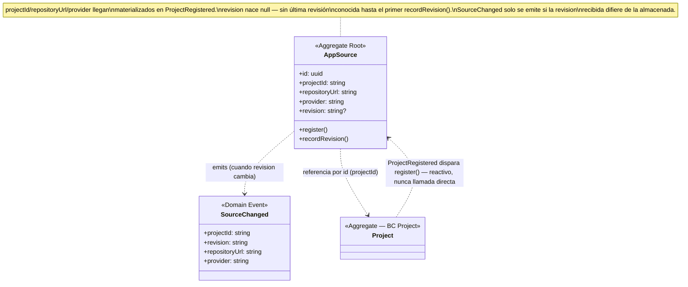

# Model — AppSource

**Derivado de**: `discovery.md` (sesión cerrada, sin ambigüedades bloqueantes)
**Fecha**: 2026-09-19

---

## Diagrama de clases

## Resumen de responsabilidades

| Elemento | Tipo | Responsabilidad |
|---|---|---|
| `AppSource` | Aggregate Root | De dónde viene el código de un `Project` y cuál es su última revisión conocida. Detecta cambios de revisión y avisa — nada más |

## Domain Actions

| Action | Comportamiento | Produce |
|---|---|---|
| `register` *(consume evento `ProjectRegistered`)* | Project se registra → AppSource reacciona creando el suyo, con `projectId`/`repositoryUrl`/`provider` materializados del evento. `revision` nace sin valor — todavía no hay una revisión conocida | `AppSource` creado, sin evento de dominio propio (mismo patrón que `Project.registerProject`, que tampoco publica al crearse) |
| `recordRevision` | Recibe una `revision` observada (de donde venga — poller, webhook, etc., es infraestructura, no dominio). Si difiere de la última conocida, la actualiza y publica `SourceChanged`; si es igual, no hace nada | `SourceChanged` si cambió, nada si no |

## Decisiones de alcance (no son dominio, pero afectan el diseño)

| Decisión | Razón |
|---|---|
| El mecanismo real que detecta una nueva `revision` (poller, webhook) no se implementa hoy | Fuera del alcance de esta sesión — hoy solo se construye la reacción a `ProjectRegistered`. `recordRevision` queda listo en el dominio, sin adaptador real que lo invoque todavía (mismo patrón que `PodiumManifestReader` en Project: placeholder honesto, no una implementación fingida) |
| `repositoryUrl` y `provider` no son Value Objects | Mismo patrón ya establecido en `Project` (que tampoco los envuelve) — son datos planos materializados desde otro BC, sin invariante propia que proteger aquí |

## Eventos publicados

| Evento | Disparado por | Payload | Consumido por | Estado |
|---|---|---|---|---|
| `SourceChanged` | `recordRevision`, cuando la revision cambia | `projectId`, `revision`, `repositoryUrl`, `provider` | Project (`processSourceChanged`) | ✅ Confirmed — ya implementado del lado de Project, falta el disparador real (poller) |

## Eventos consumidos

| Evento | Origen | Acción resultante |
|---|---|---|
| `ProjectRegistered` | Project | `register` |

## Open Questions

- Disparador real de `recordRevision` (poller cada ~1 min según el plan de infra, o webhook): no implementado hoy, solo el dominio que lo soportaría.
