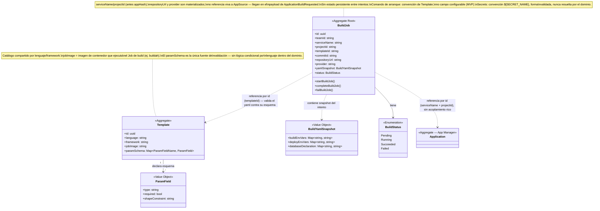

# Model — Build

**Derivado de**: `discovery.md` (sesión cerrada, sin ambigüedades bloqueantes)
**Fecha**: 2026-09-12

---

## Diagrama de clases



## Frontera de infraestructura (hexagonal)

El Job de Kubernetes, al terminar, emite una señal técnica (`JobSucceeded`/`JobFailed`) — **no es un evento de dominio**. `BuildJob` la traduce:

```
Job de Kubernetes termina → señal de infraestructura →
  BuildJob.completeBuildJob() / BuildJob.failBuildJob() →
    publica BuildSucceeded / BuildFailed (evento de dominio)
```

La señal de infraestructura nunca cruza como evento de dominio — solo las acciones de `BuildJob` lo hacen.

## Resumen de responsabilidades

| Elemento | Tipo | Responsabilidad |
|---|---|---|
| `Template` | Aggregate | Catálogo compartido por lenguaje/framework. Declara qué parámetros necesita un build de ese tipo (`paramSchema`) y con qué imagen de contenedor se ejecuta (`jobImage`) — nunca los valores concretos de una app |
| `ParamField` | Value Object | Un campo del esquema de `Template`: tipo, obligatoriedad, restricción de forma (lo que impide inyección en un campo libre) |
| `BuildJob` | Aggregate Root | Un intento de build concreto, para un servicio (`serviceName`) dentro de un `Project`. Clona el repo (`repositoryUrl`, `commitId`), lee `podium.yaml`, lo valida contra el esquema de su `Template`, ejecuta, y termina en `Succeeded`/`Failed`. Sin vida propia entre intentos |
| `BuildYamlSnapshot` | Value Object | El yaml resuelto y validado de un `BuildJob`: env vars de build (uso propio), de deploy y declaración de base de datos (se reparten hacia adelante) |

## Domain Actions

| Action | Comportamiento | Produce |
|---|---|---|
| `startBuildJob` | Consume `ApplicationBuildRequested` → crea `BuildJob` con `serviceName`, `projectId`, `templateId`, `version`, `commitId`, `repositoryUrl`, `provider` (materializados del payload) → clona, lee `podium.yaml`, valida contra `paramSchema`, ejecuta | `BuildJob` creado |
| `completeBuildJob` | Traduce la señal de infraestructura "Job terminó bien" → `BuildJob` → `Succeeded` | Publica `BuildSucceeded` |
| `failBuildJob` | Traduce fallo de infraestructura, o yaml inválido contra `paramSchema` (misma categoría, mensaje de error distinto) → `BuildJob` → `Failed` | Publica `BuildFailed` |

## Decisiones de alcance (no son dominio, pero afectan el diseño)

| Decisión | Razón |
|---|---|
| El registro de imágenes (destino del push) es configuración de infraestructura — variable de entorno del proceso de build, no un aggregate | Sin comportamiento propio para el hackathon; idea de pivote futuro (registro propio del equipo, Podium como servicio de solo imagen+job) anotada sin construir |
| El comando de arranque no es un campo — cada `Template` asume su propia convención | Evita lógica condicional por lenguaje y el riesgo de inyección en un campo libre |
| Campo `dockerfile` en `Template` — diferido | `jobImage` cubre la ejecución básica para el hackathon; más control de build queda para después |
| Las env vars (build y deploy) y la declaración de base de datos viven en `podium.yaml`, en el propio repo, nunca duplicadas dentro de Podium | Evita dos dueños de la misma verdad — el equipo ya mantiene ese dato en su repo |
| `ImageNotChanged` (deseable, diferido): si la caché de `buildah` detecta que las capas resultantes son idénticas a la imagen ya publicada, `BuildJob` no pushea nada y señaliza esto en vez de `BuildSucceeded` | Mitiga que Project reparte sin filtrar por carpeta (MVP simple) — evita un deploy innecesario cuando un servicio no cambió de verdad. `BuildStatus` necesitaría un tercer resultado terminal; pendiente resolver la transición de `Application` al recibirlo |
| Localización exacta de `podium.yaml` en el repo | Sin resolver — nota menor, no bloqueante |

## Eventos publicados

| Evento | Disparado por | Payload | Consumido por |
|---|---|---|---|
| `BuildSucceeded` | `completeBuildJob` | `serviceName`, `projectId`, `version`, referencia a la imagen, env vars de deploy y declaración de base de datos (leídas de `podium.yaml`) | App Manager, Deploy (vía `ApplicationDeployRequested`) |
| `BuildFailed` | `failBuildJob` | `serviceName`, `projectId`, `version`, mensaje de error claro (yaml inválido o fallo de compilación — misma categoría) | App Manager, Notification, Remediation |

## Eventos consumidos

| Evento | Origen | Payload relevante | Acción resultante |
|---|---|---|---|
| `ApplicationBuildRequested` | App Manager | `serviceName`, `projectId`, `templateId`, `version`, `revision`, `repositoryUrl`, `provider` | `startBuildJob` |
