# Model — Build

**Derivado de**: `discovery.md` (sesión cerrada, sin ambigüedades bloqueantes)
**Fecha**: 2026-09-12

---

## Diagrama de clases

```mermaid
classDiagram
    class Template {
        <<Aggregate>>
        +id: uuid
        +language: string
        +framework: string
        +jobImage: string
        +paramSchema: Map~ParamFieldName, ParamField~
    }

    class ParamField {
        <<Value Object>>
        +type: string
        +required: bool
        +shapeConstraint: string
    }

    class BuildJob {
        <<Aggregate Root>>
        +id: uuid
        +teamId: string
        +serviceName: string
        +projectId: string
        +templateId: string
        +commitId: string
        +repositoryUrl: string
        +provider: string
        +yamlSnapshot: BuildYamlSnapshot
        +status: BuildStatus
        +startBuildJob()
        +completeBuildJob()
        +failBuildJob()
    }

    class BuildJobLauncher {
        <<fuera de este BC — Go, diferido>>
    }

    class BuildYamlSnapshot {
        <<Value Object>>
        +buildEnvVars: Map~string, string~
    }

    class BuildStatus {
        <<Enumeration>>
        Pending
        Running
        Succeeded
        Failed
    }

    class Application {
        <<Aggregate — App Manager>>
    }

    Template "1" --> "*" ParamField : declara esquema
    BuildJob ..> BuildYamlSnapshot : contiene snapshot del intento
    BuildJob --> BuildStatus : tiene
    BuildJob ..> Template : referencia por id (templateId) — valida el yaml contra su esquema
    BuildJob ..> Application : referencia por id (serviceName + projectId), sin acoplamiento rico
    BuildJob ..> BuildJobLauncher : publica BuildJobRequested (imagen, comando, env vars)

    note for BuildJob "serviceName/projectId (antes appHash),\nrepositoryUrl y provider son materializados,\nno referencia viva a AppSource — llegan en el\npayload de ApplicationBuildRequested.\nSin estado persistente entre intentos.\nComando de arranque: convención de Template,\nno campo configurable (MVP).\nSecrets: convención ${SECRET_NAME}, forma\nvalidada, nunca resuelta por el dominio."
    note for BuildJobLauncher "Componente Go mínimo, sin lógica de dominio:\nconsume BuildJobRequested, llama a la API de\nKubernetes para crear el Job. No sabe qué es\nun Template ni valida nada. Diferido — no se\nconstruye en esta sesión."
    note for Template "Catálogo compartido por lenguaje/framework.\njobImage = imagen de contenedor que ejecuta\nel Job de build (ej. buildah).\nEl paramSchema es la única fuente de\nvalidación — sin lógica condicional por\nlenguaje dentro del dominio."
```



## Frontera de infraestructura (hexagonal)

Kubernetes nunca aparece dentro de este BC — ni para lanzar el Job, ni para leer su resultado. El ciclo completo:

```
BuildJob.startBuildJob() → publica BuildJobRequested (imagen, comando, env vars)
  → [fuera del BC] lanzador Go (diferido) crea el Job de Kubernetes
    → [fuera del BC] el propio Job clona el repo, lee y valida podium.yaml, construye
      → Job termina → señal de infraestructura (JobSucceeded/JobFailed) →
        [fuera del BC, diferido] algo la traduce y se la entrega a Build →
          BuildJob.completeBuildJob() / BuildJob.failBuildJob() →
            publica BuildSucceeded / BuildFailed (evento de dominio)
```

Ni la señal de infraestructura ni la llamada a la API de Kubernetes cruzan como evento de dominio — solo `BuildJobRequested` (salida) y `BuildSucceeded`/`BuildFailed` (salida, tras traducir el resultado) lo hacen. Hoy, sin el lanzador Go construido, la entrada de `completeBuildJob`/`failBuildJob` se modela igual que `BuildSucceeded`/`BuildFailed` en App Manager antes de que Build existiera: un DTO local (`Application/Message/JobSucceeded`, `JobFailed`) sin productor real todavía.

## Resumen de responsabilidades

| Elemento | Tipo | Responsabilidad |
|---|---|---|
| `Template` | Aggregate | Catálogo compartido por lenguaje/framework. Declara qué parámetros necesita un build de ese tipo (`paramSchema`) y con qué imagen de contenedor se ejecuta (`jobImage`) — nunca los valores concretos de una app |
| `ParamField` | Value Object | Un campo del esquema de `Template`: tipo, obligatoriedad, restricción de forma (lo que impide inyección en un campo libre) |
| `BuildJob` | Aggregate Root | Un intento de build concreto, para un servicio (`serviceName`) dentro de un `Project`. Clona el repo (`repositoryUrl`, `commitId`), lee `podium.yaml`, lo valida contra el esquema de su `Template`, ejecuta, y termina en `Succeeded`/`Failed`. Sin vida propia entre intentos |
| `BuildYamlSnapshot` | Value Object | El yaml resuelto y validado de un `BuildJob`: env vars de build (uso propio), de deploy y declaración de base de datos (se reparten hacia adelante) |

## Domain Actions

| Action | Comportamiento | Produce |
|---|---|---|
| `startBuildJob` | Consume `ApplicationBuildRequested` → resuelve `Template` por `templateId` (su `jobImage`) → crea `BuildJob` con `serviceName`, `projectId`, `teamId` (materializado desde Project, igual que `Application.teamId`), `templateId`, `version`, `commitId`, `repositoryUrl`, `provider` | `BuildJob` creado (`Pending`), publica `BuildJobRequested` |
| `completeBuildJob` | Traduce la señal de infraestructura "el Job construyó bien" (imagen resultante + `BuildYamlSnapshot`, leídos por el propio Job — ver "Frontera de infraestructura") → `BuildJob` → `Succeeded` | Publica `BuildSucceeded` |
| `failBuildJob` | Traduce fallo de infraestructura, o yaml inválido contra `paramSchema` (misma categoría, mensaje de error distinto; ambos decididos por el propio Job) → `BuildJob` → `Failed` | Publica `BuildFailed` |

## Decisiones de alcance (no son dominio, pero afectan el diseño)

| Decisión | Razón |
|---|---|
| **Split de responsabilidad (2026-09-19)**: quién clona/valida/construye (dentro del Job) siempre fue infraestructura; ahora también quién *lanza* el Job de Kubernetes sale del BC — Build solo publica `BuildJobRequested` (imagen, comando, env vars). Un componente Go mínimo, sin lógica de dominio, seria el encargado de traducirlo en una llamada a la API de Kubernetes | Mantiene todo el dominio del hackathon en un solo lenguaje/convención (PHP), y acota las credenciales del clúster a un binario pequeño y auditable. Deploy necesitará el mismo tipo de componente simétricamente, decisión diferida a cuando se aborde |
| El lanzador Go (consumidor de `BuildJobRequested`) **no se construye en esta sesión** — queda marcado para más adelante | Desplegar en el clúster real es sencillo con ArgoCD, así que el coste de sumarlo después es bajo; prioridad hoy es cerrar el dominio de Build en PHP |
| **Primer `jobImage` real (2026-09-19)**: `services/build-runner` — imagen genérica (buildah + git + yq) que clona el repo, lee `podium.yaml` y elige `templates/{lang}-{framework}.Dockerfile` internamente; no hay una imagen por lenguaje, todos los `Template` pueden apuntar al mismo `jobImage` y diferenciarse solo por qué Dockerfile de plantilla seleccionan. Primera plantilla: `nodejs`/`nestjs` (`npm ci && npm run build`, arranca con `npm start`), sembrada vía `bin/console app:build:seed-templates` | Evita construir una imagen de build por lenguaje — el "Podium provee el Dockerfile de plantilla" de `build/discovery.md` se resuelve como un archivo más dentro de una única imagen genérica, no como N imágenes a mantener |
| `completeBuildJob`/`failBuildJob` se disparan hoy vía un DTO local (`Application/Message/JobSucceeded`, `JobFailed`) sin productor real | Mismo patrón que `BuildSucceeded`/`BuildFailed` en App Manager antes de que Build existiera — el dominio queda completo y testeado aunque la señal de infraestructura real todavía no exista |
| `BuildSucceeded` **ya no lleva** `deployEnvVars`/`databaseDeclaration`: lleva `commitId`/`repositoryUrl`/`provider` | Build no transporta datos que no son suyos. Lo que la aplicación necesita para correr lo lee Deploy del mismo `podium.yaml`, en la misma revisión; lo que Build sí sabe, y por eso publica, es de dónde salió la imagen. `BuildYamlSnapshot` se queda solo con `buildEnvVars` |
| El registro de imágenes (destino del push) es configuración de infraestructura — variable de entorno del proceso que lanza el Job, no un aggregate | Sin comportamiento propio para el hackathon; idea de pivote futuro (registro propio del equipo, Podium como servicio de solo imagen+job) anotada sin construir |
| El comando de arranque no es un campo — cada `Template` asume su propia convención. `BuildJobRequested.command` viaja siempre vacío (el `jobImage` usa su propio entrypoint) | Evita lógica condicional por lenguaje y el riesgo de inyección en un campo libre |
| Campo `dockerfile` en `Template` — diferido | `jobImage` cubre la ejecución básica para el hackathon; más control de build queda para después |
| Las env vars (build y deploy) y la declaración de base de datos viven en `podium.yaml`, en el propio repo, nunca duplicadas dentro de Podium | Evita dos dueños de la misma verdad — el equipo ya mantiene ese dato en su repo |
| `ImageNotChanged` (deseable, diferido): si la caché de `buildah` detecta que las capas resultantes son idénticas a la imagen ya publicada, `BuildJob` no pushea nada y señaliza esto en vez de `BuildSucceeded` | Mitiga que Project reparte sin filtrar por carpeta (MVP simple) — evita un deploy innecesario cuando un servicio no cambió de verdad. `BuildStatus` necesitaría un tercer resultado terminal; pendiente resolver la transición de `Application` al recibirlo |
| Localización exacta de `podium.yaml` en el repo | Sin resolver — nota menor, no bloqueante |
| `BuildStatus::Running` está en el enum por completitud del modelo confirmado, pero sin trigger propio hoy | No hay señal de infraestructura distinta para "el Job empezó a correr" — todo intento vive en `Pending` hasta `Succeeded`/`Failed`. Mismo criterio que `Built` en `Application` (App Manager), que tampoco queda nunca en reposo |

## Eventos publicados

| Evento | Disparado por | Payload | Consumido por |
|---|---|---|---|
| `BuildJobRequested` | `startBuildJob` | `buildJobId`, `jobImage`, `command` (siempre `[]` hoy), `envVars` (`SERVICE_NAME`, `PROJECT_ID`, `TEMPLATE_ID`, `VERSION`, `COMMIT_ID`, `REPOSITORY_URL`, `PROVIDER`, `BUILD_JOB_ID`) | Lanzador Kubernetes (Go, diferido — sin consumidor real todavía) |
| `BuildSucceeded` | `completeBuildJob` | `serviceName`, `projectId`, `version`, referencia a la imagen, `port`, `commitId`, `repositoryUrl`, `provider` | App Manager, Deploy (vía `ApplicationDeployRequested`) |
| `BuildFailed` | `failBuildJob` | `serviceName`, `projectId`, `version`, mensaje de error claro (yaml inválido o fallo de compilación — misma categoría) | App Manager, Notification, Remediation |

## Eventos consumidos

| Evento | Origen | Payload relevante | Acción resultante |
|---|---|---|---|
| `ApplicationBuildRequested` | App Manager | `serviceName`, `projectId`, `templateId`, `version`, `revision`, `repositoryUrl`, `provider` | `startBuildJob` |
| `JobSucceeded` *(DTO local, sin productor real — ver Decisiones de alcance)* | Lanzador Kubernetes (Go, diferido) | `buildJobId`, imagen, env vars de deploy, declaración de base de datos | `completeBuildJob` |
| `JobFailed` *(DTO local, sin productor real)* | Lanzador Kubernetes (Go, diferido) | `buildJobId`, mensaje de error | `failBuildJob` |
