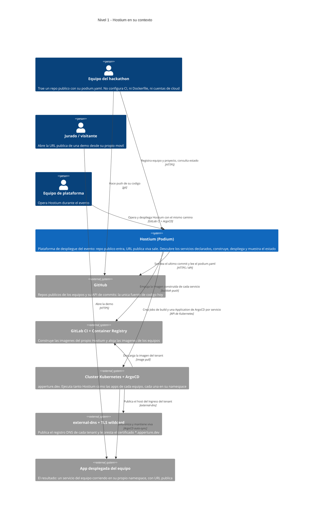
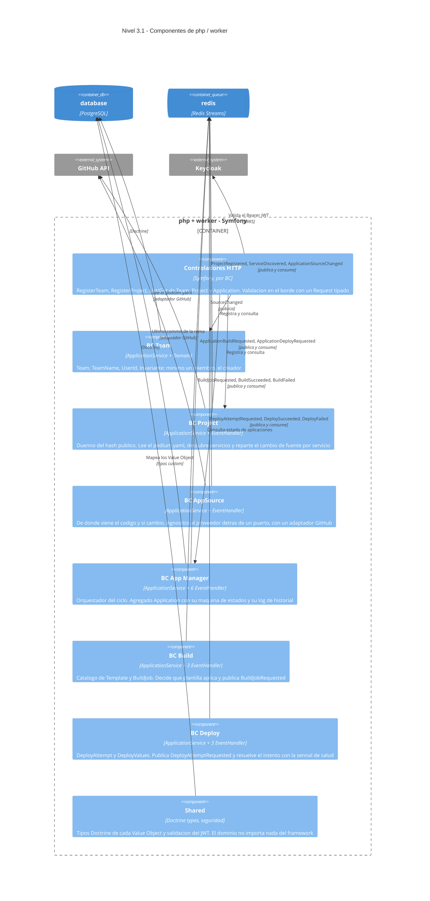
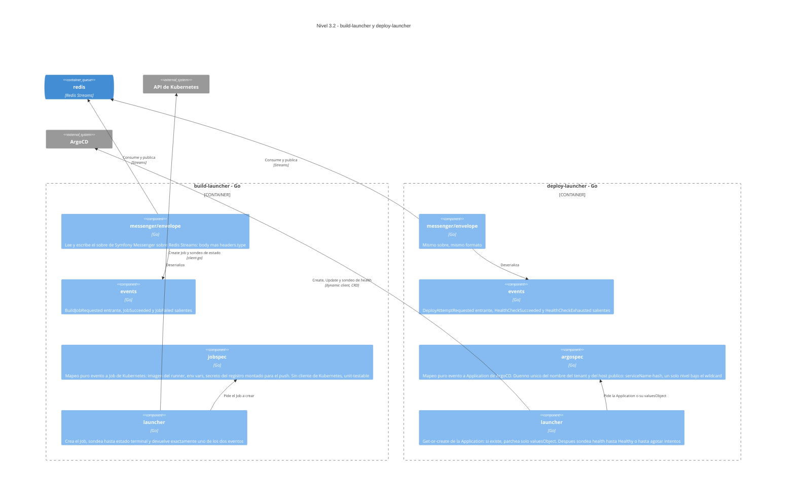
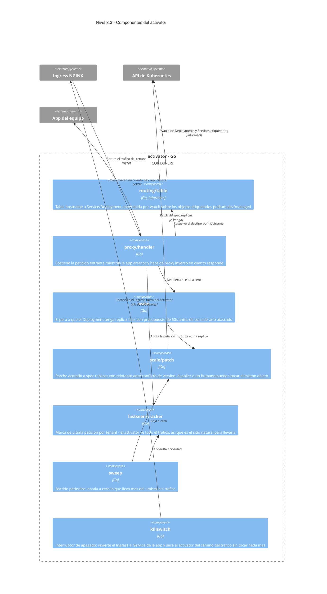
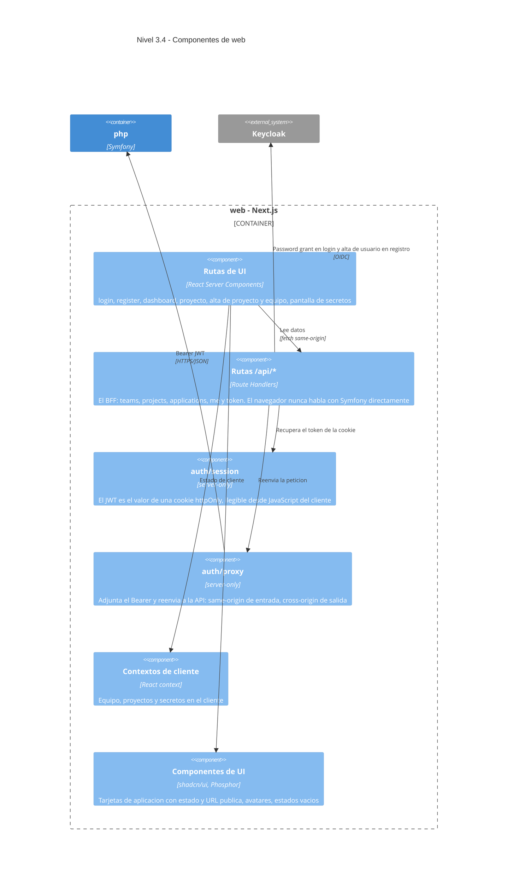
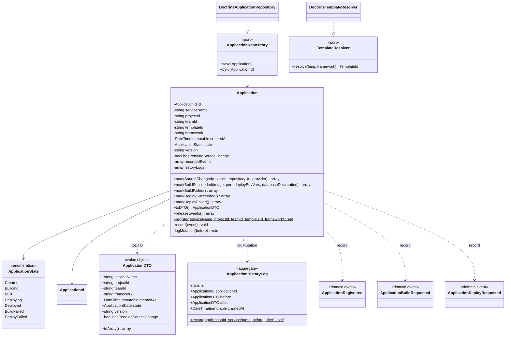
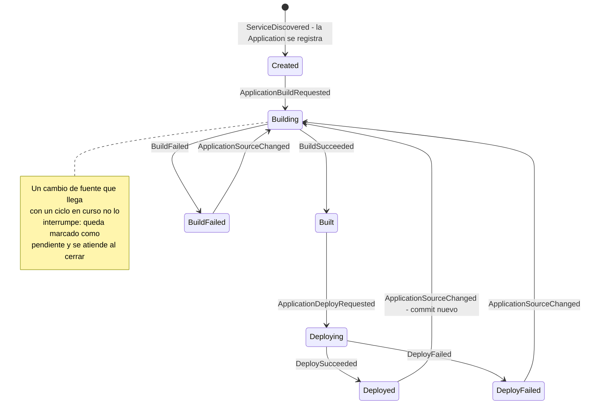
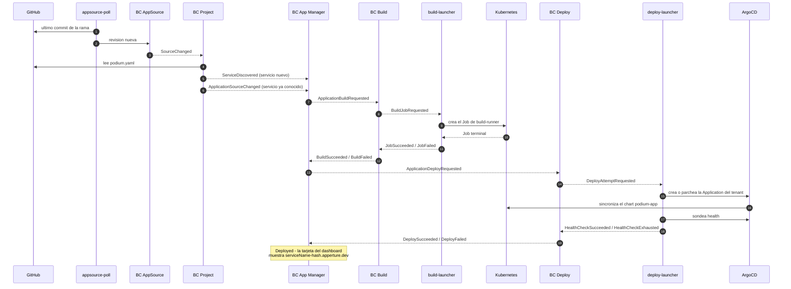

# Hostium (Podium) — Arquitectura en C4

Los cuatro niveles del modelo C4 sobre **lo que está construido y desplegado hoy**, no sobre el
plan. Cuando algo del plan no existe todavía, aparece anotado en "Lo que estos diagramas no
muestran" al final — nunca dibujado como si existiera.

- **Nivel 1 — Contexto**: Hostium frente a sus usuarios y a los sistemas externos.
- **Nivel 2 — Contenedores**: las unidades desplegables dentro del namespace `hostium`.
- **Nivel 3 — Componentes**: qué hay dentro de cada contenedor con lógica propia.
- **Nivel 4 — Código**: el agregado `Application` de App Manager, que es el orquestador del ciclo.

El modelo de dominio que hay detrás está en [`context-map.md`](context-map.md); aquí se mira la
misma verdad desde el eje del despliegue.

---

## Nivel 1 — Contexto del sistema

**Lo que este nivel dice y conviene no perder de vista:** Hostium nunca escribe en el repo del
equipo — solo lee. Y la app desplegada aparece como sistema aparte a propósito: una vez viva, el
jurado la usa sin pasar por Hostium.

---

## Nivel 2 — Contenedores

Todo lo de dentro del boundary vive en el namespace `hostium` del clúster y se despliega con
Kustomize + una `Application` de ArgoCD (`deploy/argocd/hostium.yaml`) — el mismo mecanismo que
Hostium le da a los equipos.

```mermaid
C4Container
    title Nivel 2 - Contenedores de Hostium

    Person(team, "Equipo del hackathon")
    Person(visitor, "Jurado / visitante")

    Container_Boundary(hostium, "Hostium - namespace hostium") {
        Container(web, "web", "Next.js 15 / React", "Dashboard y BFF. Las rutas /api/* del propio Next adjuntan el JWT de la cookie httpOnly y proxifican a la API: el navegador solo habla con su propio dominio")
        Container(api, "php", "Symfony 7 / FrankenPHP", "API REST de los seis bounded contexts. Solo escrituras y lecturas sincronas: registrar equipo, registrar proyecto, listar aplicaciones")
        Container(worker, "worker", "Symfony Messenger consumer", "Ejecuta los EventHandler de cada BC. Sin el, los eventos se quedan publicados en Redis sin que nadie los procese")
        Container(poller, "appsource-poll", "CronJob PHP", "Cada minuto compara la ultima revision conocida de cada AppSource contra la API de GitHub y publica SourceChanged")
        Container(buildlauncher, "build-launcher", "Go", "Consume BuildJobRequested, crea el Job de Kubernetes, espera su estado terminal y devuelve JobSucceeded o JobFailed")
        Container(deploylauncher, "deploy-launcher", "Go", "Consume DeployAttemptRequested, crea o parchea la Application de ArgoCD del tenant y sondea su salud hasta agotar intentos")
        Container(activator, "activator", "Go", "Escala a cero las apps ociosas y sostiene la peticion mientras la app despierta. Lleva su propio interruptor de apagado")
        Container(keycloak, "keycloak", "Keycloak", "Identity provider, realm podium. Emite el JWT que valida la API")
        ContainerDb(db, "database", "PostgreSQL (CNPG)", "Estado de dominio de los seis BCs")
        ContainerQueue(redis, "redis", "Redis Streams", "El bus de eventos entre bounded contexts, y la frontera PHP-Go: un stream por evento, un consumer group por consumidor")
    }

    Container_Ext(buildrunner, "build-runner", "Imagen de Job - buildah", "Efimero: clona el repo, elige el Dockerfile de plantilla segun lang/framework y empuja la imagen")
    Container_Ext(chart, "Chart podium-app", "Helm, repo OCI", "Chart generico de tenant - Deployment, Service, Ingress. Se publica una vez, fuera del ciclo de cada deploy")

    System_Ext(github, "GitHub")
    System_Ext(gitlab, "GitLab Container Registry")
    System_Ext(argocd, "ArgoCD")
    System_Ext(tenantapp, "App del equipo", "Namespace propio por Project")

    Rel(team, web, "Usa el dashboard", "HTTPS")
    Rel(web, keycloak, "Login por password grant, guarda el JWT en cookie httpOnly", "OIDC")
    Rel(web, api, "Proxifica las lecturas con Bearer JWT", "HTTPS/JSON")
    Rel(api, keycloak, "Valida la firma del JWT", "JWKS")
    Rel(api, db, "Lee y escribe agregados", "Doctrine")
    Rel(api, redis, "Publica eventos de dominio", "Streams")
    Rel(worker, redis, "Consume y publica eventos", "Streams")
    Rel(worker, db, "Lee y escribe agregados", "Doctrine")
    Rel(poller, github, "Pide el ultimo commit de la rama", "API con token")
    Rel(poller, redis, "Publica SourceChanged", "Streams")
    Rel(worker, github, "Lee el podium.yaml del repo", "API")
    Rel(buildlauncher, redis, "Consume BuildJobRequested, publica JobSucceeded/JobFailed", "Streams - JSON")
    Rel(deploylauncher, redis, "Consume DeployAttemptRequested, publica HealthCheck*", "Streams - JSON")
    Rel(buildlauncher, buildrunner, "Crea el Job que lo ejecuta", "API de Kubernetes")
    Rel(buildrunner, github, "Clona el repo en el commit pedido", "git")
    Rel(buildrunner, gitlab, "Empuja la imagen etiquetada con el commit", "buildah push")
    Rel(deploylauncher, argocd, "Crea o parchea la Application del tenant", "CRD argoproj.io")
    Rel(argocd, chart, "Renderiza el chart con los values del tenant", "Helm OCI")
    Rel(argocd, tenantapp, "Sincroniza - auto-sync, prune, selfHeal", "")
    Rel(activator, tenantapp, "Escala a cero y despierta bajo demanda", "API de Kubernetes")
    Rel(visitor, tenantapp, "Abre la demo", "HTTPS")

    UpdateLayoutConfig($c4ShapeInRow="3", $c4BoundaryInRow="1")
```

**Las dos decisiones que explican este dibujo:**

1. **Redis Streams es la única frontera entre PHP y Go.** Los transportes que cruzan a Go llevan
   serializador JSON explícito y `delete_after_ack: false`, porque PHP solo publica en ellos y es
   el consumidor Go quien crea su propio grupo y limpia (`config/packages/messenger.yaml`).
2. **Los dos lanzadores Go no tienen lógica de dominio.** Traducen un evento a un objeto de
   Kubernetes y devuelven exactamente un evento terminal. Todas las reglas viven en PHP.

---

## Nivel 3 — Componentes

### 3.1 · `php` + `worker` — los seis bounded contexts

Mismo código fuente en dos contenedores: `php` sirve HTTP, `worker` consume eventos. Cada BC
expone **un único `ApplicationService`** con un método público por caso de uso — sin command bus ni
query bus — y publica sus eventos por el bus de Messenger.

**Ningún BC llama a otro.** Todas las flechas entre contextos pasan por Redis. Por eso App Manager
puede ser el orquestador sin que Build y Deploy se conozcan entre sí.

### 3.2 · `build-launcher` y `deploy-launcher` — los dos lanzadores Go

Misma forma deliberadamente: un paquete de envelope para hablar Messenger, un paquete de mapeo
puro (testeable sin clúster) y un `launcher` que solo secuencia llamadas.

> El nombre de la `Application` y el host público salen de **una sola función** (`ApplicationName`
> sobre `tenantSlug`). Fue un bug real: el creador ponía `tenant-{serviceName}-{hash}` y el sondeo
> buscaba `tenant-{hash}`, así que el health check vigilaba un objeto inexistente y el intento no
> resolvía nunca.

### 3.3 · `activator` — escalado a cero y despertar bajo demanda

### 3.4 · `web` — dashboard y BFF

---

## Nivel 4 — Código: el agregado `Application`

El nivel 4 solo se dibuja donde aporta. Aquí aporta en **App Manager**, porque es el único sitio
donde vive la decisión de cuándo construir y cuándo desplegar.

### La máquina de estados que gobierna el ciclo

Los eventos **no los despacha el agregado**: los registra al mutar y el `ApplicationService` los
recoge con `releaseEvents()` y los publica después de persistir con éxito.

---

## Anexo — El ciclo completo, de `git push` a URL pública

No es un diagrama C4, pero es la lectura que cose los cuatro niveles.

---

## Lo que estos diagramas no muestran, porque hoy no existe

Se anota aquí en vez de dibujarse en gris, para que ningún diagrama prometa lo que el clúster no hace:

| Pieza | Estado real |
|---|---|
| **Agente de ensayo / Remediation** | No implementado. `AgentEntryPoint` en el dashboard es un mock declarado, sin llamada a LLM; el BC Remediation nunca se arrancó |
| **Notification** | Confirmado en el context map, sin código. El transporte `build_failed_notification` existe en `messenger.yaml` sin consumidor |
| **Provisioning (quota, NetworkPolicy, PSS, TTL por tenant)** | El namespace se crea (`CreateNamespace=true`), pero el chart `podium-app` solo renderiza Deployment, Service e Ingress. Las cinco NetworkPolicy están **validadas 11/11 como fixture** en `docs/hackathon-netpol/`, no aplicadas por el camino de despliegue |
| **Secretos / env vars del tenant** | `DeployValues` los lleva en el dominio, pero el `valuesObject` que llega al chart son solo `hash`, `image`, `ingress.host` y `port`. La pantalla de secretos del dashboard es fixture de frontend |
| **Base de datos por tenant (CNPG)** | Declarable en `podium.yaml`, sin materializar en el chart |
| **Catálogo de plantillas** | Dos: `nodejs/nestjs` y `nodejs/nextjs`. Otro lenguaje es un Dockerfile más en `services/build-runner/templates/` |
