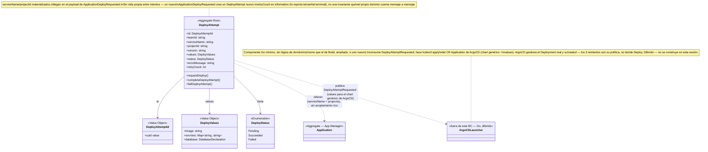

# Model — Deploy

**Derivado de**: `discovery.md` (sesión cerrada, sin ambigüedades bloqueantes)
**Fecha**: 2026-09-19

---

## Diagrama de clases



## Frontera de infraestructura (hexagonal)

Igual que Build (ver `build/model.md`): ni Kubernetes ni ArgoCD aparecen dentro de este BC.

```
DeployAttempt.requestDeploy() → publica DeployAttemptRequested (values)
  → [fuera del BC] lanzador Go (diferido) hace kubectl apply del CR Application de ArgoCD
    → [fuera del BC] ArgoCD reconcilia, gestiona el Deployment real, vigila salud (3 reintentos, su propia política)
      → salud confirmada / reintentos agotados → señal de infraestructura →
        [fuera del BC, diferido] algo la traduce y se la entrega a Deploy →
          DeployAttempt.completeDeployAttempt() / DeployAttempt.failDeployAttempt() →
            publica DeploySucceeded / DeployFailed (evento de dominio)
```

Hoy, sin el lanzador Go construido, la entrada de `completeDeployAttempt`/`failDeployAttempt` se modela como un DTO local (`Application/Message/HealthCheckSucceeded`, `HealthCheckExhausted`) sin productor real — mismo patrón que `JobSucceeded`/`JobFailed` en Build.

## Resumen de responsabilidades

| Elemento | Tipo | Responsabilidad |
|---|---|---|
| `DeployAttempt` | Aggregate Root | Un intento concreto de despliegue para un servicio dentro de un Project. Decide y publica los `values` que necesita el chart genérico de ArgoCD; traduce la señal de infraestructura terminal (salud confirmada / agotada) en `Succeeded`/`Failed`. Sin vida propia entre intentos |
| `DeployAttemptId` | Value Object | Identidad técnica del aggregate — UUID, nunca un primitivo suelto |
| `DeployValues` | Value Object | El conjunto de valores (`image`, `envVars`, `database`) que se le pasan al chart genérico de ArgoCD para renderizar el `Deployment` real. Paralelo a `BuildYamlSnapshot` en Build |
| `DatabaseDeclaration` | Value Object | La necesidad de base de datos del servicio, resuelta desde el bloque `database:` de su `podium.yaml`: `mode` (`none`/`url`/`parts`), `urlVar` y `vars`. Aquí vive la regla de que `URL` gana sobre los campos sueltos, y la traducción de los campos del yaml a las claves del Secret que genera CNPG |
| `Application` | Referencia externa (App Manager) | `DeployAttempt` lo referencia por `serviceName`+`projectId`, sin acoplamiento rico |

## Domain Actions

| Action | Comportamiento | Produce |
|---|---|---|
| `requestDeploy` | Consume `ApplicationDeployRequested` → crea `DeployAttempt` (`Pending`) con `serviceName`, `projectId`, `teamId` (materializado desde Project, igual que en Build), `version`, `values` (imagen, env vars, declaración de base de datos, todos materializados del payload) | `DeployAttempt` creado, publica `DeployAttemptRequested` |
| `completeDeployAttempt` | Traduce la señal de infraestructura "salud confirmada" (`HealthCheckSucceeded`) → `DeployAttempt` → `Succeeded` | Publica `DeploySucceeded` |
| `failDeployAttempt` | Traduce la señal de infraestructura "reintentos agotados" (`HealthCheckExhausted`) → `DeployAttempt` → `Failed` | Publica `DeployFailed` |

## Decisiones de alcance (no son dominio, pero afectan el diseño)

| Decisión | Razón |
|---|---|
| **Split de responsabilidad (2026-09-19, mismo criterio que Build)**: Deploy solo publica `DeployAttemptRequested`; un lanzador Go mínimo, sin lógica de dominio (diferido, no construido en esta sesión), hace `kubectl apply` del CR `Application` de ArgoCD | Mismo motivo que Build: un solo lenguaje/convención para todo el dominio del hackathon, credenciales del clúster acotadas a un binario pequeño. Podría ser el mismo componente Go que consume `BuildJobRequested`, ampliado — decisión de infraestructura diferida |
| **No hay imagen OCI de manifiestos por build**: el chart de Kubernetes (`podium-app`) es genérico, se publica una sola vez, fuera del ciclo de cada build/deploy | Ya estaba en el plan de hackathon original; se había pasado por alto al empezar este discovery. Simplifica `DeployValues` a solo lo variable por deploy (imagen, env vars, base de datos) — el chart en sí no es un concepto de dominio de Deploy |
| `retryCount` en `DeployAttempt`/`DeployFailed` es informativo — lo reporta la señal terminal si es fácil de incluir, pero el dominio no lo cuenta mensaje a mensaje | La invariante "3 reintentos" la decide la infraestructura (ArgoCD/el lanzador Go), no `DeployAttempt` — ver discovery.md, ambigüedad resuelta como interpretación B |
| `completeDeployAttempt`/`failDeployAttempt` se disparan hoy vía DTOs locales (`HealthCheckSucceeded`, `HealthCheckExhausted`) sin productor real | Mismo patrón que `JobSucceeded`/`JobFailed` en Build antes de que el lanzador Go exista — el dominio queda completo y testeado igualmente |
| **Deploy lee el `podium.yaml` él mismo** (puerto `PodiumManifestReader` propio, adaptador sobre el mismo `PodiumManifestFetcher` que usa Project), en la revisión que se acaba de construir | La declaración de base de datos es un dato de despliegue: Build hace una imagen y no tiene por qué saber qué necesita esa imagen para correr. Antes viajaba como pass-through por `BuildSucceeded` sin que nadie la rellenara. Ahora `ApplicationDeployRequested` trae `commitId`/`repositoryUrl`/`provider` —de dónde salió la imagen, que sí es de Build— y Deploy lee del yaml lo suyo |
| El `Cluster` de CNPG lo materializa el chart (`podium-app`), no un manifiesto que construya Deploy | El chart ya es el sitio donde se renderiza todo lo del tenant, y CNPG genera el Secret con las credenciales: `DeployValues` solo lleva `mode`/`urlVar`/`vars`, es decir **dónde** quiere el equipo recibir cada dato. Podium no genera, no guarda y no ve ninguna contraseña |
| `DeployStatus` no tiene un estado `Deploying` intermedio (a diferencia de `BuildStatus::Running`) | No hay ninguna señal parcial esperada entre `Pending` y el resultado terminal — a diferencia de Build, aquí no hay justificación documentada para modelar un estado que nunca se alcanzaría. Si aparece una señal intermedia real más adelante, se añade entonces |

## Eventos publicados

| Evento | Disparado por | Payload | Consumido por |
|---|---|---|---|
| `DeployAttemptRequested` | `requestDeploy` | `deployAttemptId`, `image`, `envVars`, `database` (ya resuelto: `mode`/`urlVar`/`vars`) | Lanzador ArgoCD (Go) |
| `DeploySucceeded` | `completeDeployAttempt` | `serviceName`, `projectId`, `version` | App Manager (`markDeploySucceeded`) |
| `DeployFailed` | `failDeployAttempt` | `serviceName`, `projectId`, `version`, `errorMessage`, `retryCount` (opcional) | App Manager (`markDeployFailed`), Remediation |

## Eventos consumidos

| Evento | Origen | Payload relevante | Acción resultante |
|---|---|---|---|
| `ApplicationDeployRequested` | App Manager | `serviceName`, `projectId`, `version`, imagen, `port`, `commitId`, `repositoryUrl`, `provider` | `requestDeploy` |
| `HealthCheckSucceeded` *(DTO local, sin productor real)* | Lanzador ArgoCD (Go, diferido) | `deployAttemptId` | `completeDeployAttempt` |
| `HealthCheckExhausted` *(DTO local, sin productor real)* | Lanzador ArgoCD (Go, diferido) | `deployAttemptId`, `errorMessage`, `retryCount` (opcional) | `failDeployAttempt` |
