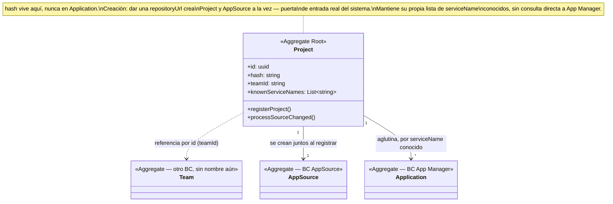

# Model — Project

**Derivado de**: `discovery.md` (sesión cerrada, sin ambigüedades bloqueantes)
**Fecha**: 2026-09-12

---

## Diagrama de clases

## Resumen de responsabilidades

| Elemento | Tipo | Responsabilidad |
|---|---|---|
| `Project` | Aggregate Root | Aglutina los servicios (Applications) declarados en el `podium.yaml` de un repo. Dueño del `hash` público y de `teamId`. Descubre servicios nuevos y reparte los cambios de fuente por servicio conocido |

## Domain Actions

| Action | Comportamiento | Produce |
|---|---|---|
| `registerProject` | El equipo da a Podium una `repositoryUrl` por primera vez → crea `Project` (con `hash`, `teamId`) y `AppSource` a la vez | `Project` + `AppSource` creados |
| `processSourceChanged` *(consume evento `SourceChanged`)* | Lee `podium.yaml` en la revisión recibida, recorre los servicios declarados: si `serviceName` ya está en `knownServiceNames` → publica `ApplicationSourceChanged`; si es nuevo → lo añade a la lista y publica `ServiceDiscovered` | `ApplicationSourceChanged` y/o `ServiceDiscovered`, uno por servicio afectado |

## Decisiones de alcance (no son dominio, pero afectan el diseño)

| Decisión | Razón |
|---|---|
| El reparto de `ApplicationSourceChanged` no filtra por carpeta (`src`) — se dispara para *todos* los servicios conocidos ante cualquier cambio | MVP simple. El desperdicio de reconstruir sin cambios reales se mitiga en Build (`ImageNotChanged`, vía caché de `buildah`), no aquí |
| Empaquetado de deploy por Application (servicio), no por Project | Un build roto de un servicio no bloquea el despliegue de los demás; revisable si en el futuro hace falta atomicidad entre servicios de un mismo Project |

## Eventos publicados

| Evento | Disparado por | Payload | Consumido por |
|---|---|---|---|
| `ApplicationSourceChanged` | `processSourceChanged`, servicio ya conocido | `serviceName`, `projectId`, `revision`, `repositoryUrl`, `provider` | App Manager |
| `ServiceDiscovered` | `processSourceChanged`, servicio nuevo | `serviceName`, `projectId`, `lang`, `framework` | App Manager (dispara `registerApplication`) |

## Eventos consumidos

| Evento | Origen | Acción resultante |
|---|---|---|
| `SourceChanged` | AppSource | `processSourceChanged` |
