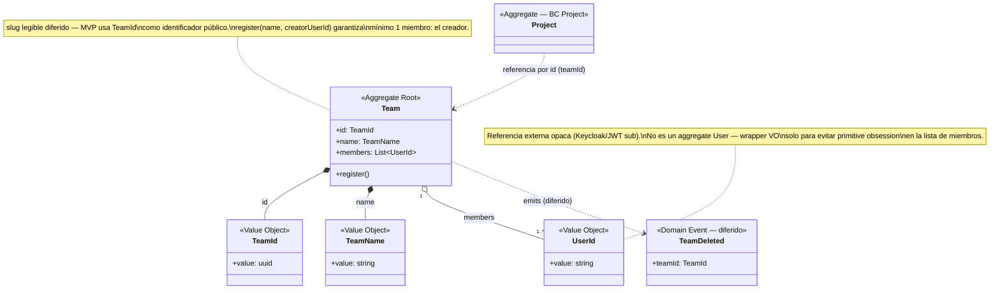

# Model — Team

**Derivado de**: `discovery.md` (sesión cerrada, sin ambigüedades bloqueantes)
**Fecha**: 2026-09-19
**status**: Accepted — sin ambigüedades bloqueantes, pero con decisiones de alcance diferidas (ver tabla de decisiones de alcance)

---

## Diagrama de clases

## Resumen de responsabilidades

| Elemento | Tipo | Responsabilidad |
|---|---|---|
| `Team` | Aggregate Root | Dueño de uno o más `Project`. Mantiene su nombre y la lista de miembros (`UserId`). Garantiza que siempre tenga al menos un miembro |
| `TeamId` | Value Object | Identidad técnica del Team (uuid) — hoy también sirve como identificador público, hasta que exista un slug legible |
| `TeamName` | Value Object | Nombre libre del Team, máx. 150 caracteres, no vacío |
| `UserId` | Value Object | Referencia opaca a un usuario (claim `sub` de Keycloak/JWT) — wrapper mínimo, no modela un aggregate `User` |

## Domain Actions

| Action | Comportamiento | Produce |
|---|---|---|
| `register` | Alguien crea un Team con un `name` → el creador (`UserId`) pasa a ser automáticamente su primer miembro, garantizando el invariante "mínimo 1 miembro siempre" | `Team` creado, sin evento de dominio publicado (mismo patrón que `Project.registerProject`, que tampoco publica evento) |

## Decisiones de alcance (no son dominio, pero afectan el diseño)

| Decisión | Razón |
|---|---|
| `slug` legible y único: diferido | Para el MVP de hoy, `TeamId` (uuid) sirve como identificador público. Mismo patrón que `Hash` en Project, sin regla de generación definitiva todavía |
| Rol de membresía (editor/viewer): diferido | Hoy todos los miembros tienen el mismo nivel de acceso — no hay distinción de permisos por ahora |
| Añadir/quitar miembros tras el registro: sin discutir | Discovery solo cubrió el primer miembro (el creador) al registrar. Unirse/salir de un Team después de creado no se modeló — abrir si hace falta antes de construirlo |

## Eventos publicados

| Evento | Disparado por | Payload | Consumido por | Estado |
|---|---|---|---|---|
| `TeamDeleted` | Borrado de un `Team` | `teamId` | Project (debería disparar borrado en cascada de sus Projects) | 🕓 Diferido — identificado y nombrado, sin implementar en el MVP de hoy |

## Eventos consumidos

*(ninguno — Team no reacciona a eventos de otros BCs por ahora)*

## Open Questions

- Añadir/quitar miembros de un Team ya existente: no se discutió el comportamiento (¿quién puede invitar? ¿puede un Team quedarse sin miembros si el último se va?). Retomar antes de implementar esa acción.
- `TeamDeleted`: implementación y el mecanismo de borrado en cascada de `Project` quedan fuera del MVP de hoy.
- `project/model.md` todavía modela `Project.teamId` como `string` crudo, no como `TeamId`. No se toca en esta sesión (este modelo es solo de Team) — dejar anotado para una pasada futura sobre el modelo de Project.
